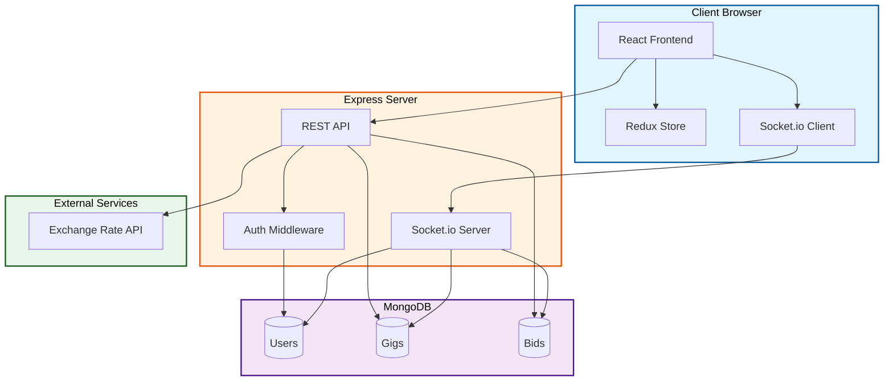
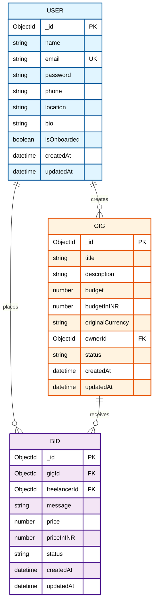

# GigFlow

A production-ready full-stack freelancing platform that connects clients with freelancers. Built with modern web technologies, GigFlow enables seamless gig creation, bidding, and hiring with real-time notifications and multi-currency support.

## Table of Contents

- [Overview](#overview)
- [Tech Stack](#tech-stack)
- [Architecture](#architecture)
- [Database Schema](#database-schema)
- [Features](#features)
- [Project Structure](#project-structure)
- [Setup Instructions](#setup-instructions)
- [API Documentation](#api-documentation)
- [Authentication Flow](#authentication-flow)
- [Hiring Process Flow](#hiring-process-flow)
- [Deployment](#deployment)
- [Environment Variables](#environment-variables)

## Overview

GigFlow is a comprehensive freelancing platform where:
- **Clients** can post gigs with budget specifications
- **Freelancers** can browse gigs and submit bids
- **Real-time notifications** keep users updated on bid status
- **Multi-currency support** with automatic conversion (USD/INR)
- **User dashboard** tracks all gigs and bids
- **Secure authentication** using JWT with HttpOnly cookies

## Tech Stack

### Frontend
- **React 18** with TypeScript
- **Vite** for build tooling
- **Tailwind CSS** for styling
- **Redux Toolkit** for state management
- **React Router** for navigation
- **Socket.io Client** for real-time updates
- **Axios** for API calls

### Backend
- **Node.js** with Express.js
- **MongoDB** with Mongoose ODM
- **JWT** for authentication
- **bcrypt** for password hashing
- **Socket.io** for real-time communication
- **Cookie-parser** for HttpOnly cookie management

## Architecture



## Database Schema



## Features

### Authentication & User Management
- User registration and login
- JWT-based authentication with HttpOnly cookies
- Password hashing with bcrypt
- User onboarding flow (phone, location, bio)
- Protected routes with middleware

### Gig Management
- Create gigs with title, description, and budget
- Choose currency (USD or INR)
- Automatic conversion to INR for storage
- Search gigs by title
- View gig details with owner information
- Track all user-created gigs in dashboard

### Bidding System
- Submit bids on open gigs
- Edit existing bids
- View bid status (pending, hired, rejected)
- Real-time bid updates via Socket.io
- Prevent multiple bids per user per gig

### Hiring Process
- Gig owners can view all bids
- Hire freelancers with atomic operations
- Automatic status updates (gig → assigned, bid → hired)
- Reject all other bids when one is hired
- Race condition prevention
- Contact information exchange upon hiring

### Real-time Features
- Socket.io integration for live updates
- Instant notifications for:
  - New bids received
  - Bid hired status
  - Gig status changes
- Notification bell with unread count

### Currency System
- Multi-currency support (USD/INR)
- Real-time exchange rate fetching
- Automatic conversion on display
- Currency selection in UI
- All prices stored in INR in database

### Dashboard
- View all created gigs
- View all placed bids
- Track bid statuses
- Access contact information for hired gigs
- Filter and organize by status

## Project Structure

```
gigflow/
├── backend/
│   ├── src/
│   │   ├── config/
│   │   │   └── database.js
│   │   ├── controllers/
│   │   │   ├── authController.js
│   │   │   ├── gigController.js
│   │   │   ├── bidController.js
│   │   │   ├── hiringController.js
│   │   │   └── onboardingController.js
│   │   ├── middleware/
│   │   │   ├── auth.js
│   │   │   └── errorHandler.js
│   │   ├── models/
│   │   │   ├── User.js
│   │   │   ├── Gig.js
│   │   │   └── Bid.js
│   │   ├── routes/
│   │   │   ├── authRoutes.js
│   │   │   ├── gigRoutes.js
│   │   │   ├── bidRoutes.js
│   │   │   ├── hiringRoutes.js
│   │   │   └── onboardingRoutes.js
│   │   ├── utils/
│   │   │   ├── generateToken.js
│   │   │   └── exchangeRate.js
│   │   ├── app.js
│   │   └── server.js
│   ├── package.json
│   └── .env.example
├── frontend/
│   ├── src/
│   │   ├── api/
│   │   │   ├── api.ts
│   │   │   ├── authApi.ts
│   │   │   ├── gigApi.ts
│   │   │   └── bidApi.ts
│   │   ├── components/
│   │   │   ├── AuthProvider.tsx
│   │   │   ├── BidForm.tsx
│   │   │   ├── ErrorBoundary.tsx
│   │   │   ├── Navbar.tsx
│   │   │   ├── NotificationBell.tsx
│   │   │   ├── PriceDisplay.tsx
│   │   │   └── ProtectedRoute.tsx
│   │   ├── contexts/
│   │   │   └── CurrencyContext.tsx
│   │   ├── hooks/
│   │   │   ├── useAppDispatch.ts
│   │   │   ├── useAppSelector.ts
│   │   │   └── useSocket.ts
│   │   ├── pages/
│   │   │   ├── Login.tsx
│   │   │   ├── Register.tsx
│   │   │   ├── Onboarding.tsx
│   │   │   ├── GigFeed.tsx
│   │   │   ├── CreateGig.tsx
│   │   │   ├── GigDetails.tsx
│   │   │   └── Dashboard.tsx
│   │   ├── store/
│   │   │   ├── slices/
│   │   │   │   ├── authSlice.ts
│   │   │   │   └── notificationSlice.ts
│   │   │   └── store.ts
│   │   ├── utils/
│   │   │   └── exchangeRate.ts
│   │   ├── App.tsx
│   │   └── main.tsx
│   ├── package.json
│   └── .env.example
└── README.md
```

## Setup Instructions

### Prerequisites

- Node.js (v18 or higher)
- MongoDB (local installation or MongoDB Atlas account)
- npm or yarn package manager

### Backend Setup

1. Navigate to backend directory:
```bash
cd backend
```

2. Install dependencies:
```bash
npm install
```

3. Create `.env` file:
```env
MONGODB_URI=mongodb://localhost:27017/gigflow
JWT_SECRET=your-super-secret-jwt-key-change-this-in-production
PORT=5000
NODE_ENV=development
CLIENT_URL=http://localhost:5173
EXCHANGE_RATE_API_KEY=your-api-key-optional
```

4. Start development server:
```bash
npm run dev
```

Server runs on `http://localhost:5000`

### Frontend Setup

1. Navigate to frontend directory:
```bash
cd frontend
```

2. Install dependencies:
```bash
npm install
```

3. Create `.env` file:
```env
VITE_API_URL=http://localhost:5000/api
VITE_EXCHANGE_RATE_API_KEY=your-api-key-optional
```

4. Start development server:
```bash
npm run dev
```

Frontend runs on `http://localhost:5173`

## API Documentation

### Authentication Endpoints

| Method | Endpoint | Description | Auth Required |
|--------|----------|-------------|---------------|
| POST | `/api/auth/register` | Register new user | No |
| POST | `/api/auth/login` | Login user | No |
| GET | `/api/auth/me` | Get current user | Yes |
| POST | `/api/auth/logout` | Logout user | No |

### Gig Endpoints

| Method | Endpoint | Description | Auth Required |
|--------|----------|-------------|---------------|
| GET | `/api/gigs` | Get all open gigs (supports ?search=) | No |
| GET | `/api/gigs/:id` | Get single gig | No |
| POST | `/api/gigs` | Create new gig | Yes |
| GET | `/api/gigs/user/my-gigs` | Get user's gigs | Yes |

### Bid Endpoints

| Method | Endpoint | Description | Auth Required |
|--------|----------|-------------|---------------|
| POST | `/api/bids` | Create or update bid | Yes |
| GET | `/api/bids/:gigId` | Get bids for gig (owner only) | Yes |
| GET | `/api/bids/user/:gigId` | Get user's bid for gig | Yes |
| GET | `/api/bids/user/my-bids` | Get all user's bids | Yes |

### Hiring Endpoints

| Method | Endpoint | Description | Auth Required |
|--------|----------|-------------|---------------|
| PATCH | `/api/bids/:bidId/hire` | Hire a freelancer | Yes (owner only) |

### Onboarding Endpoints

| Method | Endpoint | Description | Auth Required |
|--------|----------|-------------|---------------|
| PATCH | `/api/onboarding` | Complete user onboarding | Yes |

## Authentication Flow

```mermaid
sequenceDiagram
    participant Client
    participant Frontend
    participant Backend
    participant Database
    participant Cookie
    
    Client->>Frontend: Register/Login
    Frontend->>Backend: POST /api/auth/register or /login
    Backend->>Database: Validate/Create User
    Database-->>Backend: User Data
    Backend->>Backend: Generate JWT Token
    Backend->>Cookie: Set HttpOnly Cookie
    Backend-->>Frontend: User Data (no password)
    Frontend->>Frontend: Store in Redux
    Frontend-->>Client: Authenticated
    
    Note over Client,Cookie: Subsequent Requests
    Client->>Frontend: API Request
    Frontend->>Backend: Request with Cookie
    Backend->>Backend: Verify JWT from Cookie
    Backend->>Database: Fetch Protected Data
    Database-->>Backend: Data
    Backend-->>Frontend: Response
    
    style Client fill:#e1f5ff,stroke:#01579b,stroke-width:2px,color:#000
    style Frontend fill:#fff3e0,stroke:#e65100,stroke-width:2px,color:#000
    style Backend fill:#f3e5f5,stroke:#4a148c,stroke-width:2px,color:#000
    style Database fill:#e8f5e9,stroke:#1b5e20,stroke-width:2px,color:#000
    style Cookie fill:#fce4ec,stroke:#880e4f,stroke-width:2px,color:#000
```

## Hiring Process Flow

```mermaid
sequenceDiagram
    participant Client
    participant Freelancer
    participant Frontend
    participant Backend
    participant Database
    participant Socket
    
    Client->>Frontend: Create Gig
    Frontend->>Backend: POST /api/gigs
    Backend->>Database: Save Gig (status: open)
    Database-->>Backend: Gig Created
    Backend-->>Frontend: Gig Data
    
    Freelancer->>Frontend: View Gig & Submit Bid
    Frontend->>Backend: POST /api/bids
    Backend->>Database: Save Bid (status: pending)
    Database-->>Backend: Bid Created
    Backend->>Socket: Emit 'new-bid' event
    Socket-->>Client: Notification
    Backend-->>Frontend: Bid Created
    
    Client->>Frontend: View Bids & Hire
    Frontend->>Backend: PATCH /api/bids/:bidId/hire
    Backend->>Database: Atomic Update Gig (status: assigned)
    Backend->>Database: Atomic Update Bid (status: hired)
    Backend->>Database: Update Other Bids (status: rejected)
    Database-->>Backend: Updates Confirmed
    Backend->>Socket: Emit 'bid-hired' event
    Backend->>Socket: Emit 'gig-updated' event
    Socket-->>Freelancer: Notification
    Backend-->>Frontend: Hire Confirmed
    
    style Client fill:#e1f5ff,stroke:#01579b,stroke-width:2px,color:#000
    style Freelancer fill:#fff3e0,stroke:#e65100,stroke-width:2px,color:#000
    style Frontend fill:#f3e5f5,stroke:#4a148c,stroke-width:2px,color:#000
    style Backend fill:#e8f5e9,stroke:#1b5e20,stroke-width:2px,color:#000
    style Database fill:#fce4ec,stroke:#880e4f,stroke-width:2px,color:#000
    style Socket fill:#fff9c4,stroke:#f57f17,stroke-width:2px,color:#000
```

## Deployment

### Railway Deployment

#### Backend Deployment

1. Create new Railway project
2. Connect GitHub repository
3. Set root directory to `backend`
4. Add MongoDB service (or use MongoDB Atlas)
5. Configure environment variables:
   - `MONGODB_URI` - MongoDB connection string
   - `JWT_SECRET` - Secure random string
   - `NODE_ENV` - Set to `production`
   - `CLIENT_URL` - Your frontend URL
   - `PORT` - Railway provides this automatically

#### Frontend Deployment

1. Create new Railway project (or add to existing)
2. Connect GitHub repository
3. Set root directory to `frontend`
4. Configure build command: `npm run build`
5. Set start command: `npm run preview` (or use static file serving)
6. Configure environment variables:
   - `VITE_API_URL` - Your backend API URL

### MongoDB Atlas Setup

1. Create account at [MongoDB Atlas](https://www.mongodb.com/cloud/atlas)
2. Create new cluster
3. Create database user
4. Whitelist IP addresses (or 0.0.0.0/0 for Railway)
5. Get connection string
6. Update `MONGODB_URI` in backend environment variables

## Environment Variables

### Backend (.env)

```env
MONGODB_URI=mongodb://localhost:27017/gigflow
JWT_SECRET=your-super-secret-jwt-key-change-this-in-production
PORT=5000
NODE_ENV=development
CLIENT_URL=http://localhost:5173
EXCHANGE_RATE_API_KEY=your-api-key-optional
```

**Variable Descriptions:**
- `MONGODB_URI` - MongoDB connection string (use MongoDB Atlas URI for production)
- `JWT_SECRET` - Secret key for JWT token signing (use strong random string in production)
- `PORT` - Server port (Railway provides this automatically in production)
- `NODE_ENV` - Environment mode (development/production)
- `CLIENT_URL` - Frontend URL for CORS configuration
- `EXCHANGE_RATE_API_KEY` - Optional API key for exchange rate service

### Frontend (.env)

```env
VITE_API_URL=http://localhost:5000/api
VITE_EXCHANGE_RATE_API_KEY=your-api-key-optional
```

**Variable Descriptions:**
- `VITE_API_URL` - Backend API base URL (must include `/api` at the end)
- `VITE_EXCHANGE_RATE_API_KEY` - Optional API key for exchange rate service

## Key Features Explained

### Atomic Hiring Operations

The hiring process uses MongoDB atomic operations to prevent race conditions:

1. **Gig Status Update**: Uses `findOneAndUpdate` with condition `status: 'open'` to ensure only one hire succeeds
2. **Bid Status Update**: Uses `findOneAndUpdate` with condition `status: 'pending'` to prevent double-hiring
3. **Bulk Rejection**: Uses `updateMany` to reject all other pending bids atomically

### Currency Conversion System

- All prices stored in INR in database
- Original currency preserved for display
- Real-time conversion using exchange rate API
- Caching mechanism (1 hour) to reduce API calls
- Fallback rate (83) if API fails

### Real-time Notifications

Socket.io events:
- `new-bid` - Notifies gig owner of new bid
- `bid-hired` - Notifies freelancer when hired
- `gig-updated` - Broadcasts gig status changes
- `hire-confirmed` - Confirms hire to gig owner

### Security Features

- HttpOnly cookies prevent XSS attacks
- JWT tokens for stateless authentication
- Password hashing with bcrypt
- Protected routes with middleware
- CORS configuration for API security

## License

ISC
